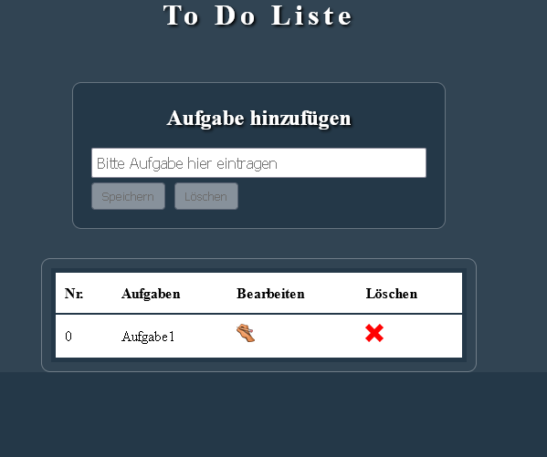

# toDoList-React-v2

Eine kleine ToDoListe mit Speicherung der Daten im Local Storage.

Verwendung von redux statt useState

1. npm install
2. npm run dev

Eine Vorschau ist hier zu finden:

 https://todolist-react-v2.netlify.app/

